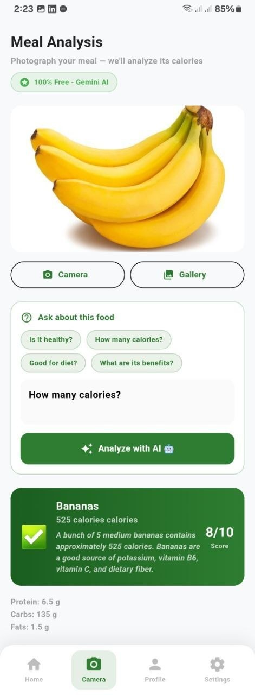
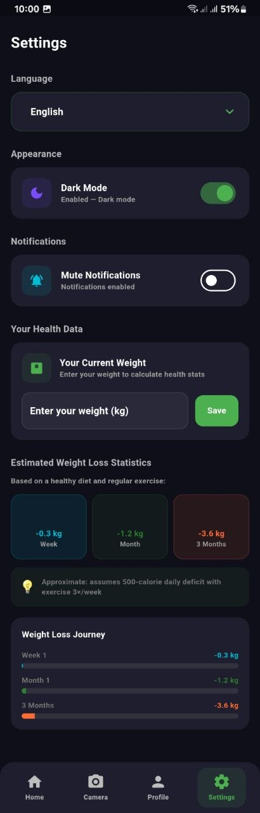

# Health Snap AI – AI-powered health analysis application

is a an AI-powered mobile application that analyzes food and symptoms using AI image analysis using Gemini API.

---

## Tech Stack

- Flutter (Mobile Development)
- Dart
- AI Integration (Gemini AI / APIs)
- State Management (Bloc / Cubit )

---

## UI Preview

### Home Screen

### Meal Analysis Screen

### Settings Screen

---

## How to Run the Project

### 1. Clone the repository

git clone https://github.com/your-username/Health-Snap-AI.git

### 2. Navigate to the project directory

### 3. Install dependencies

### 4. Run the application

---

## Prerequisites

- Flutter SDK installed
- Dart SDK configured
- Android Studio or VS Code
- Android emulator or physical device

---

## Environment Setup

If the project uses environment variables:

### 1. Create a `.env` file in the root directory

### 2. Add required keys

Example:

API_KEY=your_api_key_here

### 3. Add `.env` to `.gitignore`

---

## Security Note

API keys and sensitive data are not included in this repository and are managed securely using environment variables.

---
